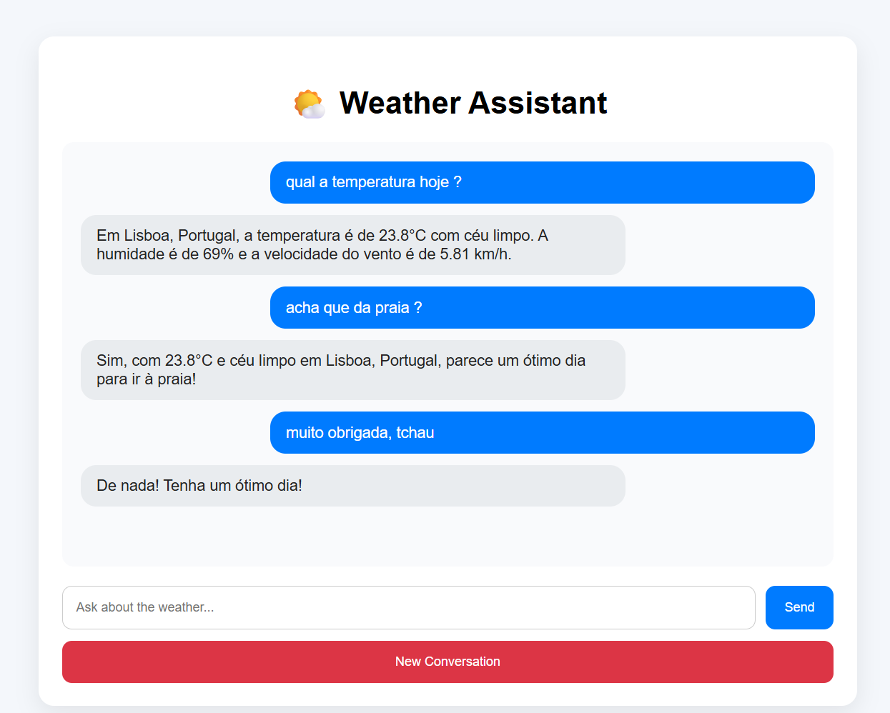

# Weather Agent 🌤️

AI-powered weather assistant built with Python, Flask, Gemini, LangChain and LangGraph.



## Features

* Real-time weather information
* Automatic location detection
* Conversation memory
* SQLite persistence
* PostgreSQL/Supabase support
* Tool calling with LangGraph
* Gemini integration

## Tech Stack

* Python
* Gemini
* LangChain
* LangGraph
* SQLite
* PostgreSQL
* OpenWeatherMap API
* IPInfo API

## Installation

```bash
git clone https://github.com/coniemenezes/weather-agent.git

cd weather-agent

pip install -r requirements.txt
```

Create a .env file based on .env.example

Run:

```bash
python main.py
```

## Architecture

User → Agent → Tools

Tools:

* Weather API
* Location API

Persistence:

* SQLite
* PostgreSQL

LLM:

* Gemini
